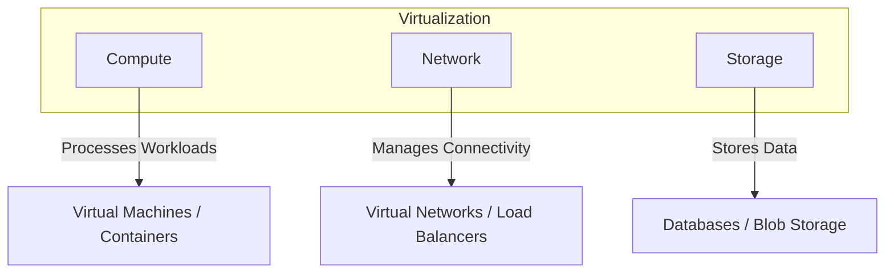
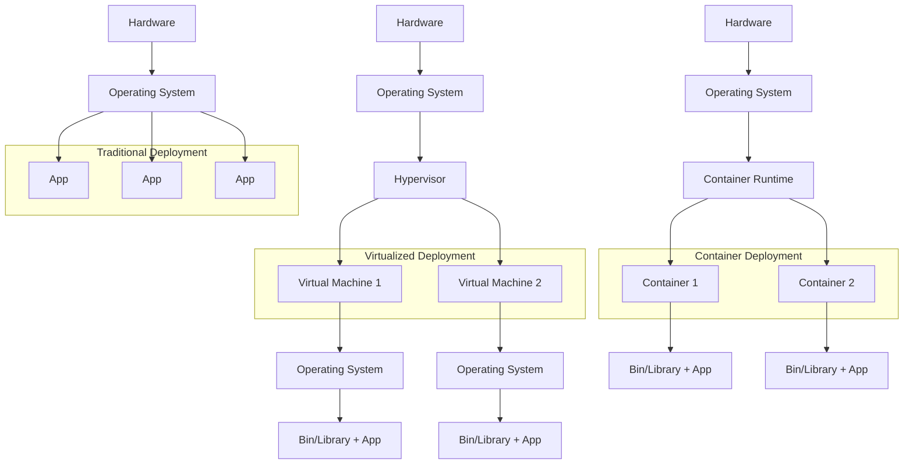

# Containerization With Docker

## Virtual Machine
It is a software-based emulation of a physical computer. It runs an operating system (OS) and applications just like a real computer, but instead of running directly on hardware, it operates inside a virtualized environment managed by a hypervisor.

* Hypervisor creates and manages VMs.
* Each VM gets cirtual CPU, RAM, storage, and network resources.
* Multiple VMs can run on the same physical hardware, sharing the resources remaining isolated.

### What is Hypervisor
* It is a software that provides hardware-level virtualization.
* Compute, Network, and Storage are the three pillars when considering virtualization.



### Types of Virtualization
- Hardware-Level Virtualization. (Uses Hypervisor to create VMs)
- OS-Level Virtualization.(Uses containers)

## Container Evolution



## What is Docker
It is an open-source containerization platform designed to simplify the development, deployment, and management of applications.
It helps us to manage application infrastructure using various concepts such as images, containers, Swarms, and Microservices.

## Docker Components
1. **Docker Engine**: It is the core software that enables containerization.It allows us to build , run, and manage containers on a host system.
2. **Images and containers**: Docker images are the read-only templates containing the application code and environment, while containers are runtime instances of these images that execute in isolated environments.
3. **Storage and volumes**: Docker storage manages data peristence for containers.
Volumes store data outside the container's filesystem, ensuring it persists across restarts and re-creations.
4. **Compose and Hub** Docker Compose is a tool for defining and managing multi-container docker applications.Docker Hub is a cloud based registry service for storing, sharing, and distributing Docker images.
5. **Network and registry**: Docker networks enable secure, isolated communication between containers.Docker registries, like Docker Hub or private registries, store and distribute Docker images.

## Why use Docker
- **Consistency Across Environments**: It ensures that application works seamlessly in any environment from development through staging to production.
- **Rapid Deployment**: Containers can be spun up in seconds much faster than deploying applications on physical or virtual machines.
- **Microservices Architecture**: It suits microservices architectures by allowing each component to run in seperate container with all dependencies.
- **Scalability**: Containers can be easily started, stopped or replicated across hosts to scale out or handle increased load.

## Docker Architecture
Docker is build on a client-server model consisting of three main components: Docker Client, Host, and Registry


## Docker Commands
```bash
$ docker --version ## to check docker version
$ docker image ls ## to list the docker images
$ docker images ## to list the docker images
$ docker image pull jenkins ## to pull images from the hub
```
- `docker run` consists of three operations
  - docker pull
  - docker container create
  - docker container start

### Example of docker run command with details
- `docker run -dt --name nginx-lb -p 8081:80 ngnix` 
  - `docker run` command to start new container
  - `-d` runs container in detached mode (background)
  - `-t`  allocates a pseudo-TTY, which is helpful for interactive processes (although not strictly necessary for a simple nginx container in detached mode, it is a good practice).
  - `--name nginx-lb` assigns the name nginx-lb to the container.This should be unique.
  - `-p 8081:80` publishes port 80 of the container to port 8081 of the host machine, if you access http://localhost:8081 in your browser, you will be directed to the nginx web server running in the container
  - `nginx` specifies the docker image to use.
- Check if the container is running `docker ps`
- To getting inside the `docker exec -it nginx-lb /bin/sh`
- To see logs `docker logs nginx-lb`
- Stop the container using the command `docker stop nginx-lb`
- Remove the container `docker rm ngnix-lb`
- Remove the image `docker rmi nginx`

### Example of Creating the Docker Image
```bash
$ mkdir node-docker
$ cd node-docker
## Create sample app.js file here
```
```js
// app.js
const http = require('http');

const hostname = '0.0.0.0';
const port = 80;

const server = http.createServer((req, res) => {
    res.statusCode = 200;
      res.setHeader('Content-Type', 'text/plain');
        res.end('Hello Docker Chief\n');
});

server.listen(port, hostname, () => {
    console.log('Server running at http://%s:%s/', hostname, port);
});

process.on('SIGINT', function() {
    console.log('Caught interrupt signal and will exit');
    process.exit();
});
```
```bash
// Create a file named Dockerfile here
```
```Dockerfile
# Use an official Node runtime as the parent image
FROM node:6

# Set the working directory in the container to /app
WORKDIR /app

# Copy the current directory contents into the container at /app
ADD . /app

# Make the container's port 80 available to the outside world
EXPOSE 80

# Run app.js using node when the container launches
CMD ["node", "app.js"]
```
```bash
# Create a Container Image
$ docker build -t node-app:0.1 -f ./Dockerfile .
# Check to see image is created
$ docker images
# Create the container with the image created
$ docker run --name node-app -dt -p 82:80 node-app:0.1
# Check the container is running or not
$ docker ps
$ docker logs node-app
```
